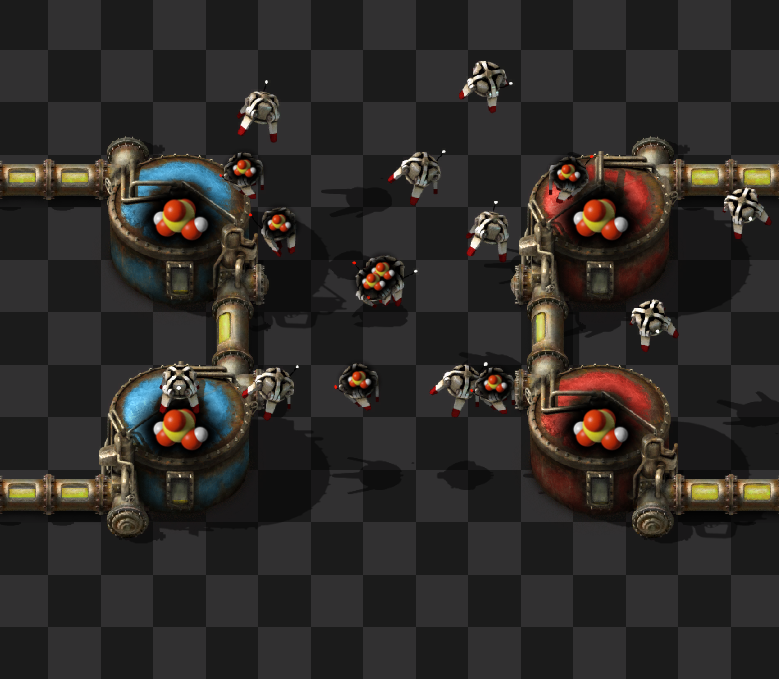

# Logistic Tanks
Connect storage tanks to the logistics network so robots can move fluids around your base without the need for barreling/unbarreling. Additionally provides logistic versions of Anicha's 1x1 minibuffers for compact fluid delivery.

## Motivation
1. Barreling and unbarreling are an extra complication to carrying fluids with logistic robots, and take a bunch of extra space, especially in a mall.
2. The logistic robots already have a compartment for storing items that they transport around the factory - so why not make the compartment water-tight and capable of directly transporting fluids. When the robot docks with the logistic variants of storage tanks, it fills/empties its internal tank.

## Features
1. Passive provider tank, requester tank, and buffer tank that act like their logistic chest variants but for fluids instead of items.
2. Logistic variants of Anicha's 1x1 minibuffers for providing/requesting fluids within a small footprint.
3. Set the filter on requester/buffer tanks to indicate what type of fluid they require.
    - The filter is set with a convenient side GUI when opening the tank GUI.
    - The filter may only be changed if the tank is empty - we don't want mixed fluid networks!
    - Requester tanks may be configured to request from buffer tanks as well.
4. Storage tank that acts like a storage chest but must be filtered.
4. Copy/paste requests from assembly machines onto requester/buffer tanks just like logistic chests.
5. Circuit connections to the tanks read the contents of the tank.
    - The requests of a requester/buffer tank cannot be set using the circuit network. This is limited because we don't want mixed fluid networks.
6. The amount of fluid in the logistic network can be read from roboports - be careful as these are virtual signals not the typical fluid signal - find them in the virtual signal tab in combinator interfaces not in the fluid tab! - and are equivalent to 1/50th (w/ default settings) the actual amount of fluid stored.
7. Logistic robots recipe includes barrels, since the robots need somewhere to store the fluid they transport.
    - Can be enabled/disabled in mod settings. Defaults to enabled.
8. Limited UPS impact, only checks up to 10 tanks per tick = 600 tanks per second.
    - Number of tanks checked per tick can be increased to increase throughput of fluids at a potential UPS cost for bases making heavy use of logistic tanks.

## Limitations
1. The active provider tank is intentionally left unavailable by default. Due to the internal setup of this mod, an active provider tank could provide to a storage chest - which would break the mod's goal of keeping the fluids in the logistic network separate from the items in it. You may enable this in the mod settings if you are willing to have the fluids provided by the active provider tank stored in standard storage chests.
    - To work around this limitation, rather than having high priority fluids be provided by active provider tanks, have high priority fluids be provided by storage tanks. Then use a requester tank where the fluid should be stored - it will prioritize pulling from storage tanks over passive provider tanks.
2. Even with the above precaution it is still possible for a storage chest to have fluids inserted directly by logistic robots if the requester tank to which they are transporting fluids is destroyed while they are travelling. In most cases this will resolve itself when the requester tank is rebuilt and the fluid in the storage chest is prioritized over fluid in a passive provider tank due to the priority order of the logistic network.
4. The amount of fluids in the logistic network read from a roboport with "read logistic network contents" enabled are not the typical fluid signals. They are special fluid in logistic network variants that are equivalent to 50 standard fluid units by default (the amount if equivalent to mod setting for "liquid per cargo slot"). They can be found in the virtual signals tab rather than the fluids tab. In order for these signals to be interactable in combinators, the logistic network item equivalents of each fluid are also choosable within the filters of requester, buffer, and storage chests. If you do not want to mix the fluids in the logistic network with the chests, do not select these filters.

## Credits
1. [test447](https://mods.factorio.com/user/test447) - code, minibuffer mask, tech icon
2. [Kirazy](https://mods.factorio.com/user/Kirazy) - storage tank mask
3. [Anicha](https://mods.factorio.com/user/Anicha) - minibuffer dependency
